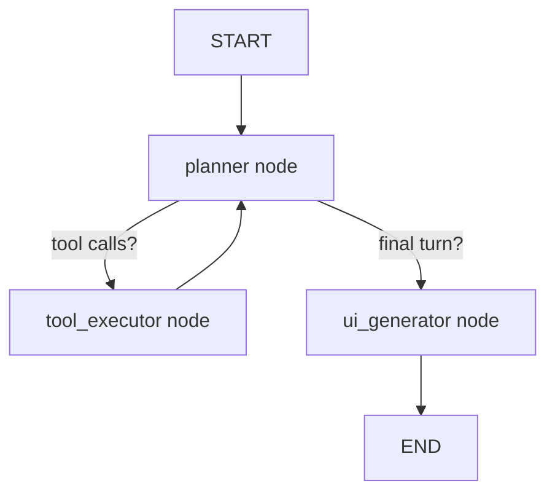

# Architecture Reference

Details explaining Teardrop's internal agent runtime, LangGraph state machine flow, AG-UI SSE streaming layer, and UI component generation standard.

---

## Agent Graph (`agent/graph.py`)

The agent runs as a LangGraph state machine with the following execution flow:

- **planner** — Sends the conversation history to the configured LLM with all tools bound. If the LLM decides to call tools, the status becomes `EXECUTING`; otherwise, it initiates UI generation.
- **tool_executor** — Executes all pending tool calls concurrently, appending `ToolMessage` results, and populates a compact `slots` fact store utilized by subsequent planner turns.
- **ui_generator** — Extracts or generates A2UI component JSON properties from the final assistant message and binds it to the state.

When `AGENT_COMPILER_MODE_ENABLED=true` is set, planner turns may emit an optional staged `<plan>{...}</plan>` block. The executor then processes staged calls with dependency-aware argument resolution while keeping the overall graph topology stable.

Conversation history persists across turns via `AsyncPostgresSaver` (Postgres-backed LangGraph checkpointer).

---

## Streaming & Server-Sent Events (`teardrop/routers/agent.py`)

The main streaming endpoint `POST /agent/run` returns a live Server-Sent Events (SSE) stream. 

### Emitted SSE Event Types

| Event | When |
|-------|------|
| `RUN_STARTED` | Immediately on executing the request |
| `TEXT_MESSAGE_CONTENT` | Each text/assistant token chunk received from the provider |
| `TOOL_CALL_START` | Before a tool begins execution |
| `TOOL_CALL_END` | After a tool returns output |
| `SURFACE_UPDATE` | When A2UI components are ready |
| `BILLING_SETTLEMENT` | After on-chain or off-chain payment ledger records settle |
| `USAGE_SUMMARY` | Total tokens, cache-read/create tokens, tools, and cost for the entire run |
| `RUN_FINISHED` | Sent when the agent finishes normally |
| `ERROR` | Sent on unhandled graph exceptions |
| `DONE` | Sent immediately before connection closure |

---

## A2UI Component System (`agent/state.py`)

The agent can return structured UI models alongside text. The current schema supports the following schema types in `A2UIComponent`:

| Type | Properties |
|------|------------|
| `text` | `content`, `variant` (`body` \| `heading` \| `caption`) |
| `table` | `columns`, `rows` |
| `columns` | `children` |
| `rows` | `children` |
| `form` | `fields`, `submit_label` |
| `button` | `label`, `action` |
| `progress` | `value` (0–100), `label` |
