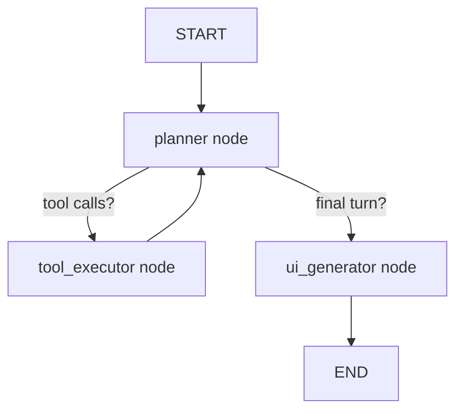

# Architecture Reference

Details explaining Teardrop's portable agent nodes, current LangGraph adapter, AG-UI SSE streaming layer, and UI component generation standard.

---

## Agent Graph (`agent/graph.py`)

The current runtime adapter uses LangGraph for routing and checkpointing with the following execution flow:


```mermaid
graph TD
    START --> planner[planner node]
    planner -->|tool calls?| tool_executor[tool_executor node]
    tool_executor --> planner
    planner -->|final turn?| ui_generator[ui_generator node]
    ui_generator --> END
```

- **planner** — Sends the conversation history to the configured LLM with all tools bound. If the LLM decides to call tools, the status becomes `EXECUTING`; otherwise, it initiates UI generation. With `AGENT_TOOL_SHORTLIST_ENABLED=true`, only a relevance-scored subset (≤`AGENT_TOOL_SHORTLIST_MAX_TOOLS`) of tool schemas is bound per planner turn; the setting is validated to retain all always-keep tools, while tool listings and executor resolution remain unchanged.
- **tool_executor** — Executes all pending tool calls concurrently, appending `ToolMessage` results, and populates a compact `slots` fact store utilized by subsequent planner turns.
- **ui_generator** — Extracts or generates A2UI component JSON properties from the final assistant message and binds it to the state.

When `AGENT_COMPILER_MODE_ENABLED=true` is set, planner turns may emit an optional staged `<plan>{...}</plan>` block. The executor then processes staged calls with dependency-aware argument resolution while keeping the overall graph topology stable.

Conversation history persists across turns via `AsyncPostgresSaver` (Postgres-backed LangGraph checkpointer).

Planner and executor nodes receive executable org, MCP, and marketplace tool wrappers through `agent/runtime_context.py`. This request-scoped context is isolated across concurrent tasks and is never serialized into checkpoints. `agent/runtime_events.py` translates LangGraph events into framework-neutral runtime events before the SSE layer consumes them; LangGraph-specific metadata does not cross that boundary.

### Retention And Data Tiers

Each graph invocation records its thread in `checkpoint_thread_activity` before writing checkpoints. The periodic retention worker locks inactive thread rows before deleting their checkpoints, blobs, and writes, so a newly resumed thread cannot lose fresh state during a sweep.

| Records | Retention policy |
|---------|------------------|
| LangGraph checkpoint state | Configurable inactive-thread TTL; 45 days by default |
| `scheduled_run_results` | Disposable output cache; 30 days by default |
| `a2a_inbound_tasks` | Transient asynchronous inbound task projections with process leases; terminal rows are retained for 7 days by default |
| `org_tool_events` with `executed` or `failed` event types | Disposable execution telemetry; 90 days by default |
| `telemetry_run_starts` | Run-source completeness denominator; 120 days by default |
| Expired `siwe_login_sessions` | Deleted every retention pass because they can contain short-lived token material |
| `usage_events`, `org_credit_ledger`, settlements, Stripe events, marketplace earnings/withdrawals, `a2a_inbound_events` | Immutable financial or audit records; never swept |
| `tool_call_events`, `run_decisions` | Long-lived ML and routing telemetry; each row carries `source` (`api`, `schedule`, `trigger`, or `a2a`); never swept |
| `labeling_predictions`, targets, and results | Structured ML labels; 365 days by default via `LABELING_RETENTION_DAYS`; never mixed with billing ledgers |

Retention sweeps are batched, parameterized, and log per-table counts on every pass. The Sentry cron monitor covers failed or stalled sweeps. Setting a configurable TTL to `0` disables that table's cleanup.

## Generalized Labeling Data Plane (`labeling/`)

Scheduled runs can call the internal `record_predictions` tool once with the exact machine-readable prediction document. Its arguments are retained only for this opt-in tool; ordinary tool telemetry remains hash-only. The scheduled runner stores the prediction asynchronously after a successful run, while the existing callback receives `output_text`, which is the mobile-friendly human report.

Scheduled callbacks remain JSON by default for compatibility. Set a schedule's `callback_format` to `text` to POST only `output_text` as `text/plain`, which is suitable for ntfy and similar mobile endpoints.

The labeling worker is disabled by default and uses six shared Postgres tables: versioned definitions, schedule bindings, predictions, target items, deduplicated observations, and append-only results. It claims target items with `FOR UPDATE SKIP LOCKED` leases, batches compatible provider requests, retries unavailable observations with bounded backoff, and never changes billing, settlement, usage, or scheduled-run status. The three current task classes use thin parser/provider/scorer adapters over the same engine; new trusted adapters add no tables or worker loops.

Prediction payloads are bounded JSON, definition versions are immutable, server timestamps define evaluation windows, and organization scope is enforced on bindings, predictions, targets, results, and private observation scopes. Existing JSON-plus-report prompts remain supported through a bounded JSON-prefix fallback while migrated prompts send the JSON through `record_predictions` and return only the report.

---

### Marketplace Withdrawal Settlement

Marketplace earnings are claimed in a short database transaction before CDP network I/O. The withdrawal then moves through `pending` → `in_flight` → `settled` or `failed`; `in_flight` claims are excluded from automatic sweeps until an administrator confirms the on-chain result. Claimed earnings carry their withdrawal ID, so reset can release only the affected rows. A confirmation timeout is never retried automatically because the transfer may already have been broadcast; reset is permitted only after the chain shows no transfer occurred.

## Streaming & Server-Sent Events (`teardrop/routers/agent.py`)

The main streaming endpoint `POST /agent/run` returns a live Server-Sent Events (SSE) stream. 

### Emitted SSE Event Types

| Event | When |
|-------|------|
| `RUN_STARTED` | Immediately on executing the request |
| `TEXT_MESSAGE_START` | Before the first text/assistant token chunk of a message |
| `TEXT_MESSAGE_CONTENT` | Each text/assistant token chunk received from the provider |
| `TEXT_MESSAGE_END` | After the final text/assistant token chunk of a message |
| `TOOL_CALL_START` | Before a tool begins execution |
| `TOOL_CALL_END` | After a tool returns output |
| `SURFACE_UPDATE` | When A2UI components are ready |
| `BILLING_SETTLEMENT` | After on-chain or off-chain payment ledger records settle |
| `USAGE_SUMMARY` | Total tokens, cache-read/create tokens, tools, and cost for the entire run |
| `RUN_FINISHED` | Sent when the agent finishes normally |
| `ERROR` | Sent on unhandled graph exceptions |
| `DONE` | Sent immediately before connection closure |
| `Custom` | Application-defined structured payloads (e.g. tool output, agent warnings) |

`STATE_SNAPSHOT` is a reserved AG-UI event type but is not currently emitted.

---

## A2UI Component System (`agent/state.py`)

The agent can return structured UI models alongside text. `A2UIComponent` is a generic, recursive model — each component carries a `type` tag, a free-form `props` dict, and nested `children`:

```python
class A2UIComponent(BaseModel):
    type: str = Field(..., description="Component type: text|table|columns|rows|form|button|progress")
    props: dict[str, Any] = Field(default_factory=dict, description="Component properties")
    children: list["A2UIComponent"] = Field(default_factory=list, description="Nested children")
```

The supported `type` values are `text`, `table`, `columns`, `rows`, `form`, `button`, and `progress`. Property shapes are not statically typed per component type — they are carried in the free-form `props` dict (e.g. `text` uses `content`/`variant`; `form` uses `fields`/`submit_label`; `button` uses `label`/`action`; `progress` uses `value`/`label`). The `ui_generator` node (`agent/node_ui.py`) either extracts A2UI JSON from the assistant message (`_extract_a2ui_from_text` / `_parse_a2ui_json`) or generates it, then binds the resulting components to the state.
